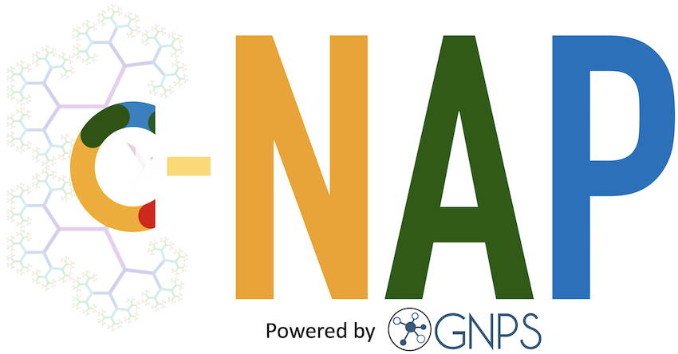
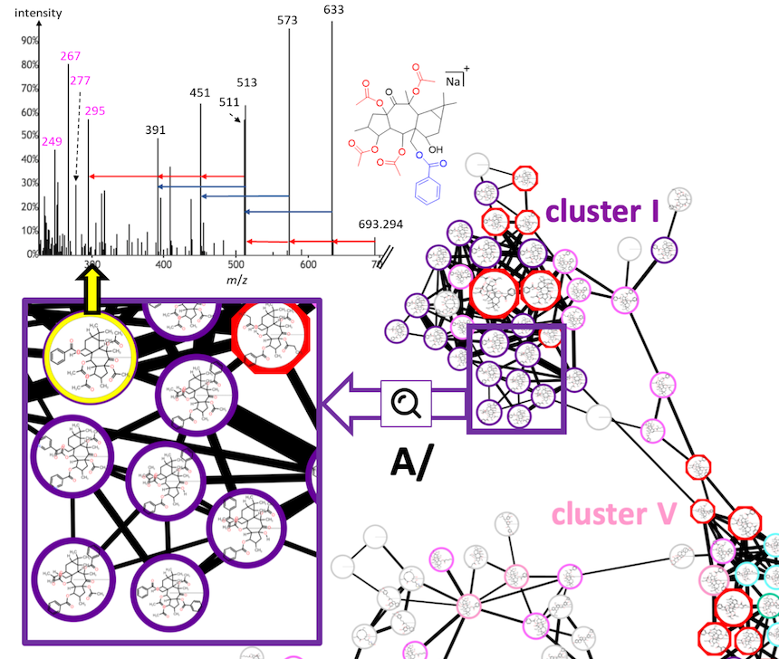

# Combinatorial Network Annotation Propagation (C-NAP) on GNPS

* [Introduction](#introduction)
* [Step-by-Step documentation for C-NAP](#Step-by-Step_documentation_for_C-NAP)
* [Citations](#citations)

## Introduction

Creating a combinatorial structure database to be used with Network Annotation Propagation (NAP) on GNPS. This approach can be used to generate a list of theoritical compounds that can be used for in silico annotation with molecular networks. It is suited for class of metabolites with a limited number of building blocks. We successfully employed C-NAP for the annotation of Euphorbia diterpene esters, and rapidly annotate numerous diterpene esters, including compounds that have not yet been described. Nevertheless, C-NAP can be applied only on a species/sample with a minimum knowledge available on the composition (e.g., the isolated compounds, reference MS/MS spectra, and chemotaxonomy). See the manuscript for more details.

**Graphical Abstract from the manuscript**

**Figure from the manuscript. Molecular networks annoted with C-NAP. View in Cytoscape.**

**Presented in the following publication:**

Meĺissa Nothias- Esposito, Louis Felix Nothias, Ricardo R. Da Silva, Pascal Retailleau, Zheng Zhang, Pieter Leyssen, Fanny Roussi, David Touboul, Julien Paolini, Pieter C. Dorrestein, and Marc Litaudon. Investigation of Premyrsinane and Myrsinane Esters in Euphorbia cupanii and Euphobia pithyusa with MS2LDA and Combinatorial Molecular Network Annotation Propagation. J. Nat. Prod. 2019 ASAP. 

## Step-by-Step documentation for C-NAP
### 1. Prepare the Combinatorial Structure DataBase (CSDB)
- Prepare your scaffolds, linkers and building blocks for [SmiLib v2.0](http://melolab.org/smilib/). Refer to the [SmiLib v2.0 documentation](http://melolab.org/smilib/SmiLib_v2.0.pdf) and see the template files.
- Download, install and run [SmiLib v2.0](http://melolab.org/smilib/) to generate the CSDB. [See documentation](http://melolab.org/smilib/SmiLib_v2.0.pdf).
- If needed, process your CSDB as required (remove duplicates, keep only one positional isomers,...).

### 2. Format the CSDB for C-NAP
- Prepare your CSDB for C-NAP. This can be done with the NAP database generator [webpage and script](https://github.com/DorresteinLaboratory/NAP_ProteoSAFe/#creating-a-custom-database).

### 3. Run your C-NAP job
- Upload your NAP-formatted CSDB [via FTP](https://ccms-ucsd.github.io/GNPSDocumentation/fileupload/) to your GNPS personal account. [http://gnps.ucsd.edu](http://gnps.ucsd.edu). 
- Run a molecular networking job ([V2](https://ccms-ucsd.github.io/GNPSDocumentation/networking/) or [Feature-Based Molecular Network](https://ccms-ucsd.github.io/GNPSDocumentation/featurebasedmolecularnetworking/)).
- Launch and configure a [NAP job (must be logged first)](https://proteomics2.ucsd.edu/ProteoSAFe/?params={%22workflow%22:%22NAP_CCMS2%22}) using a molecular networking job ([see documentation](https://ccms-ucsd.github.io/GNPSDocumentation/nap/)). Select the CSDB in "User provided database". Note that other databases can be added simultaniously in "Structure database", and will be appended to the job database.
- Follow NAP documentation to visualize and inspect the structures of C-NAP in Cytoscape or the Web app. [See documentation](https://ccms-ucsd.github.io/GNPSDocumentation/nap/).

## Citations
Presented in the following publication:
Meĺissa Nothias-Esposito, Louis Felix Nothias, Ricardo R. Da Silva, Pascal Retailleau, Zheng Zhang, Pieter Leyssen, Fanny Roussi, David Touboul, Julien Paolini, Pieter C. Dorrestein, and Marc Litaudon. Investigation of Premyrsinane and Myrsinane Esters in Euphorbia cupanii and Euphobia pithyusa with MS2LDA and Combinatorial Molecular Network Annotation Propagation. J. Nat. Prod. 2019 ASAP. 

Structure were generated with SmiLib:
Schüller, A., Hähnke, V. & Schneider, G. SmiLib v2.0: A Java-Based Tool for Rapid Combinatorial Library Enumeration. QSAR Comb. Sci. 26, 407–410 (2007).
[https://onlinelibrary.wiley.com/doi/abs/10.1002/qsar.200630101](https://onlinelibrary.wiley.com/doi/abs/10.1002/qsar.200630101)

C-NAP uses molecular networking on GNPS:
 Wang, M.; Carver, J. J.; Phelan, V. V.; Sanchez, L. M.; Garg, N.; Peng, Y.; Nguyen, D. D.; Watrous, J.; Kapono, C. A.; Luzzatto-Knaan, T.; et al. Sharing and Community Curation of Mass Spectrometry Data with Global Natural Products Social Molecular Networking. Nat. Biotechnol. 2016, 34 (8), 828–837. [https://www.nature.com/articles/nbt.3597](https://www.nature.com/articles/nbt.3597)

C-NAP is a version of NAP: 
da Silva, R. R.; Wang, M.; Nothias, L.-F.; van der Hooft, J. J. J.; Caraballo-Rodríguez, A. M.; Fox, E.; Balunas, M. J.; Klassen, J. L.; Lopes, N. P.; Dorrestein, P. C. Propagating Annotations of Molecular Networks Using in Silico Fragmentation. PLoS Comput. Biol. 2018, 14 (4), e1006089. [http://journals.plos.org/ploscompbiol/article?id=10.1371/journal.pcbi.1006089](http://journals.plos.org/ploscompbiol/article?id=10.1371/journal.pcbi.1006089)

NAP uses MetFrag for in silico annotation:
Wolf, S.; Schmidt, S.; Müller-Hannemann, M.; Neumann, S. In Silico Fragmentation for Computer Assisted Identification of Metabolite Mass Spectra. BMC Bioinformatics 2010, 11 (1), 148. [https://bmcbioinformatics.biomedcentral.com/articles/10.1186/1471-2105-11-148](https://bmcbioinformatics.biomedcentral.com/articles/10.1186/1471-2105-11-148)

NAP uses the Fusion concept, proposed on for MetFusion for ranking improvement from spectral library: 
Gerlich, M.; Neumann, S. MetFusion: Integration of Compound Identification Strategies. J. Mass Spectrom. 2013, 48 (3), 291–298. [https://onlinelibrary.wiley.com/doi/abs/10.1002/jms.3123](https://onlinelibrary.wiley.com/doi/abs/10.1002/jms.3123)
